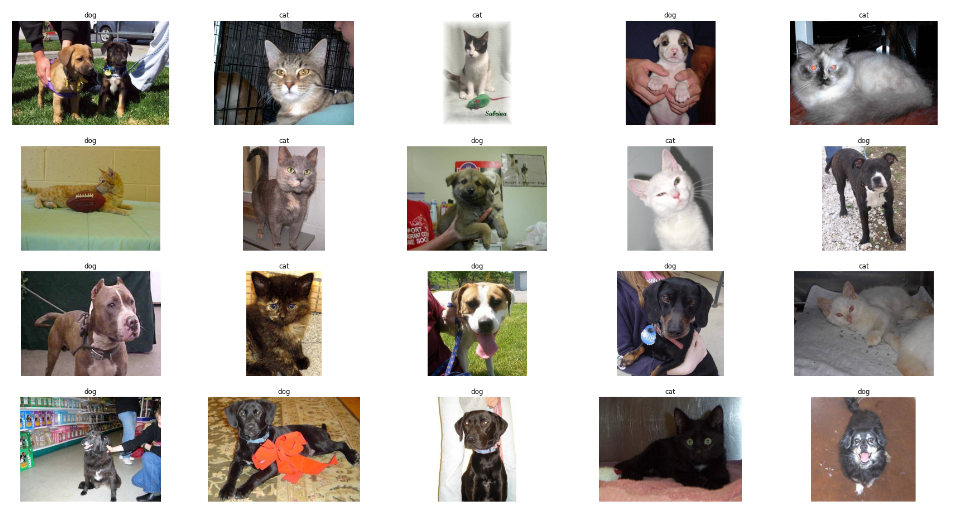
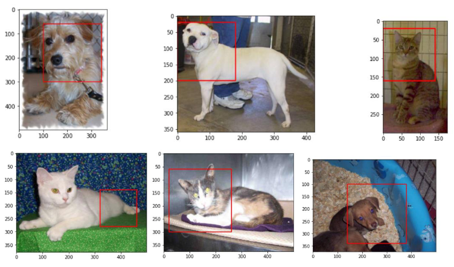

# Dog and cat classification

## Introduction

An image classification and detection project on dog and cat images.
From the given single-object image, we need to classify the image into 2 classes:

- Dog class
- Cat class

Furthermore, we also try to detect the position of that object on the image (localization).

## Dataset

We use the dataset from Kaggle: [Dogs vs cats](https://www.kaggle.com/c/dogs-vs-cats)

## Classification

### Model

In this project we try four models of VGG-style, including:

- VGG 1-block
- VGG 2-block
- VGG 3-block
  Each block of the molde contains a pair of Convolute2D and Pooling, then followed by an Fully-connected layer.

Moreover, we also leverage the VGG-16 model to do transfer learning. We use the pretrained VGG-16 model without the top layer and train the new output layer (fixed weights for other layers).

    

        
    

    

        <b>VGG-16 model architecture</b>
    

### Gallery

    

        
    

    

        <b>Classification result</b>
    

## Image detection

### Algorithm - Sliding window

To do the detection task, we use the very idea which is the sliding window. The algorithm try different of windows and slide on the image to find the most-condfident zone.

### Gallery

    

        
    

    

        <b>Detection result</b>
    

## Contributors

This project was developed by our team, including:

- [phuc16102001](https://github.com/phuc16102001/)
- [thanhoang4869](https://github.com/thanhoang4869)
- [buingocchinh321](https://github.com/buingocchinh321)

## License
[MIT](LICENSE)